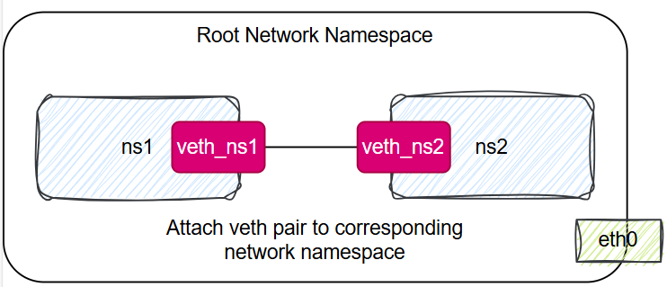

# Network Namespaces in Linux

## Overview

A **network namespace** is a Linux kernel feature that provides an isolated environment for networking. Each namespace has its own network interfaces, routing table, firewall rules, and NAT rules. This isolation allows you to create multiple virtual networks on a single host, each operating independently.

Network namespaces are widely used in containerization technologies such as Docker and Kubernetes to provide isolated network environments for containers.

---

## Step-by-Step Guide: Connecting Network Namespaces with a Virtual Ethernet Pair

This guide demonstrates how to create two isolated network namespaces and connect them using a virtual Ethernet (veth) pair.

### 1. Create Network Namespaces

A network namespace can be created using the `ip netns add` command:

```bash
ip netns add <namespace-name>
```


For example, to create two namespaces named `ns1` and `ns2`:

```bash
ip netns add ns1
ip netns add ns2
```

You can verify the namespaces have been created:

```bash
ip netns list
```

---

### 2. Create a Virtual Ethernet (veth) Pair

A veth pair acts like a virtual network cable connecting two interfaces. Creating a veth pair gives you two connected interfaces. This will behave like a virtual cable. 

```bash
ip link add <veth_interface_1> type veth peer name <veth_interface_2>
```


For example:

```bash
ip link add veth_ns1 type veth peer name veth_ns2
```

This creates two interfaces, `veth_ns1` and `veth_ns2`, connected to each other.

List all network interfaces to verify:

```bash
ip link list
```

---

### 3. Assign veth Interfaces to Namespaces

Move each end of the veth pair into its respective namespace:

```bash
ip link set <veth_interface> netns <namespace>
```


For example:

```bash
ip link set veth_ns1 netns ns1
ip link set veth_ns2 netns ns2
```

Now, `veth_ns1` exists only in `ns1`, and `veth_ns2` only in `ns2`.

---

### 4. Bring Up the Interfaces

Enable the interfaces inside their namespaces:

```bash
ip netns exec <namespace> ip link set <veth_interface> up
```


For example:

```bash
ip netns exec ns1 ip link set veth_ns1 up
ip netns exec ns2 ip link set veth_ns2 up
```

You can list interfaces inside a namespace:

```bash
ip netns exec ns1 ip link list
ip netns exec ns2 ip link list
```

---

### 5. Assign IP Addresses

Assign IP addresses to each veth interface:

```bash
ip netns exec <namespace> ip addr add <IP_address>/<subnet_mask> dev <veth_interface>
```


For example:

```bash
ip netns exec ns1 ip addr add 10.1.1.1/24 dev veth_ns1
ip netns exec ns2 ip addr add 10.1.1.2/24 dev veth_ns2
```

Check the assigned addresses:

```bash
ip netns exec ns1 ip addr list
ip netns exec ns2 ip addr list
```

Check routing tables:

```bash
ip netns exec ns1 ip route list
ip netns exec ns2 ip route list
```

---

### 6. Test Connectivity

Ping between the namespaces to verify connectivity:

```bash
ip netns exec ns1 ping 10.1.1.2
ip netns exec ns2 ping 10.1.1.1
```


If the ping is successful, your namespaces are connected!

---


## Step-by-Step Guide: Connect Network Namespaces Using a Linux Bridge
A bridge is a software device that connects multiple network interfaces together, allowing them to communicate with each other.

### 1. Create network namespaces
```bash
ip netns add ns1
ip netns add ns2
```

### 2. Create a Linux bridge


```bash
ip link add <bridge_name> type bridge
```

For example:
```bash
ip link add br0 type bridge
```

### 3. Bring the bridge up


```bash
ip link set dev br0 up
```

### 4. Create veth pairs


```bash
ip link add veth_ns1 type veth peer name veth_ns1_br0
ip link add veth_ns2 type veth peer name veth_ns2_br0
```

### 5. Attach veth pairs to the corresponding network namespace and the bridge


```bash
ip link set veth_ns1 netns ns1
ip link set veth_ns1_br0 master br0

ip link set veth_ns2 netns ns2
ip link set veth_ns2_br0 master br0
```

### 6. Bring all interfaces up


```bash
$ ip netns exec ns1 ip link set veth_ns1 up
$ ip link set veth_ns1_br0 up

$ ip netns exec ns2 ip link set veth_ns2 up
$ ip link set veth_ns2_br0 up
```

### 7. Configure IP for namespaces


```bash
ip netns exec ns1 ip addr add 10.1.1.1/24 dev veth_ns1
ip netns exec ns2 ip addr add 10.1.1.2/24 dev veth_ns2
```

### 8. Test connectivity between the namespaces


```bash
ip netns exec ns1 ping 10.1.1.2
ip netns exec ns2 ping 10.1.1.1
```

No need to add route, bridge add it automatically.

This process can be repeated for any number of namespaces, allowing you to create complex network topologies with isolated environments for each application.


## Connect Host to Network Namespaces
### 1. Configure the bridge interface with an IP address


```bash
ip addr add 10.1.1.4/24 dev br0
```

### 2. Enable IP forwarding on the host

```bash
sysctl -w net.ipv4.ip_forward=1
```

### 3. Test connectivity between host and namespaces

```bash
$ ping 10.1.1.1
$ ping 10.1.1.2
```

## Additional Notes

- **Network namespaces** are powerful for simulating networks, testing, and containerization.
- You can create more complex topologies by adding bridges, more namespaces, or connecting namespaces to the host network.

- List existing network namespaces on the system
  ```bash
  ip netns
  ```

- To delete a namespace:  
  ```bash
  ip netns del <namespace>
  ```

---

## References

- [Linux Network Namespace Documentation](https://man7.org/linux/man-pages/man7/network_namespaces.7.html)
- [ip-netns(8) man page](https://man7.org/linux/man-pages/man8/ip-netns.8.html)

---

## Images

Images referenced in this guide illustrate each step. Please refer to the images in this repository for visual guidance.

---

Feel free to open issues or pull requests if you have questions or suggestions!